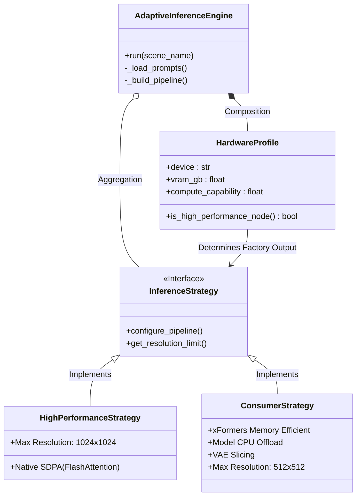

# ⚡ Adaptive-Motion-Lab

**High-Performance AnimateDiff Pipeline with Hardware-Aware Optimization.**

[](https://www.python.org/)
[](https://pytorch.org/)
[](https://huggingface.co/docs/diffusers/index)
[](https://opensource.org/licenses/MIT)

## 📖 Overview

**Adaptive-Motion-Lab** is a production-engineered wrapper for the [AnimateDiff](https://github.com/guoyww/AnimateDiff) architecture, specifically designed to mitigate "configuration fatigue" when deploying Latent Diffusion Models across heterogeneous hardware environments—ranging from entry-level T4 instances to high-end NVIDIA H100 clusters.

At its core, the engine utilizes a **Strategy Design Pattern** to perform runtime hardware detection. It dynamically orchestrates VRAM allocation policies and injects optimized attention mechanisms (such as **PyTorch SDPA** or **xFormers**) based on the detected Compute Capability and available memory overhead.

## 🏗️ Architecture

The engine implements a **Hardware Abstraction Layer (HAL)** that dynamically selects the execution strategy at runtime.



## 🎬 Gallery

Demonstration of **Adaptive Inference** pipeline stages running on **NVIDIA T4** (Survival Mode):

* **Act 1: Latent Initialization** — Seeding the latent space and hardware profiling.
* **Act 2: Adaptive Motion Synthesis** — Generating temporal dynamics using memory-efficient attention (xFormers).
* **Act 3: Temporal Consistency** — Final stabilization and artifact refinement.

| Act 1: Noise Initialization | Act 2: Motion Synthesis |
| :---: | :---: |
|  |  |
| *Running on T4 (Survival Strategy)* | *Running on T4 (Survival Strategy)* |

<details>
<summary>👁️ <b>View Act 3: Final Stabilization</b></summary>
<br>


*Result of full optimization pipeline on T4*
</details>

### Hardware Strategy Comparison

The engine automatically selects the best strategy based on your GPU:

| Strategy | Target Hardware | Optimization Features |
| :--- | :--- | :--- |
| **Survival Strategy** (Active in Demo) | NVIDIA T4 / Consumer GPUs | xFormers, CPU Offload, VAE Slicing |
| **High-Perf Strategy** | NVIDIA A100 / H100 / 4090 | Native SDPA (FlashAttention), Max Throughput |

## 🚀 Key Features

### 1. Hardware-Aware Dispatch (HAL)
The engine automatically profiles the GPU at runtime:
* **Ampere+ (A100, 3090+):** Unlocks `HighPerformanceStrategy` (Native PyTorch 2.0 SDPA).
* **Legacy/Consumer (T4, V100):** Activates `SurvivalStrategy` (xFormers + CPU Offload).

### 2. Deterministic & Reproducible
* Cross-platform seeding via CPU-based `torch.Generator`.
* Strict prompt management via JSON configuration.

## 📦 Installation & Usage

### 1. Cloud Execution (Google Colab)
For users without high-end local GPUs, use the provided launcher:
1. Open `notebooks/Colab_Launcher.ipynb` in GitHub.
2. Click the **"Open in Colab"** button or download the notebook to Drive.

### 2. Local Development
```bash
# Clone the repository
git clone [https://github.com/BorisKlimchenko/Adaptive-Motion-Lab.git](https://github.com/BorisKlimchenko/Adaptive-Motion-Lab.git)
cd Adaptive-Motion-Lab

# Install dependencies
pip install -r requirements.txt

# Run Inference (using default config)
python main.py

# Run Inference (using custom config)
python main.py --prompts configs/default_scene.json